# JKMem - AI Medical Memory System

<p align="center">
  
  
  
</p>

An intelligent medical consultation assistant with persistent memory capabilities. JKMem combines LLM-powered conversations with structured memory storage, enabling context-aware medical consultations across sessions.

## ✨ Features

- **🧠 Persistent Memory**: Remembers patient information, medical history, and consultation context across sessions
- **📊 Medical Report Parsing**: Upload and analyze medical reports (lab results, examinations)
- **🔍 Semantic Search**: Find relevant memories using natural language queries
- **📈 Graph Database Support**: Optional knowledge graph for complex medical relationships
- **💬 Natural Conversations**: Powered by Alibaba Qwen LLM for accurate Chinese medical responses

## 🏗️ Architecture

```mermaid
flowchart TB
  subgraph CUI["CUI Agent (Phase 5)"]
    cli["CLI 对话界面"]
  end

  subgraph Ingest["Ingestion Pipelines"]
    report["报告解析"]
    normalize["实体标准化"]
    create["记忆创建"]
    report --> normalize --> create
  end

  subgraph Memory["Memory Service (Core)"]
    mem0["Mem0 编排器"]
    schema["数据 Schema"]
    domain["领域逻辑"]
    mem0 --> schema
    mem0 --> domain
  end

  subgraph Cache["缓存层"]
    l1["L1 会话缓存"]
    l2["L2 热点缓存"]
    l1 --> l2
  end

  subgraph Storage["持久化存储"]
    vector["向量存储语义检索"]
    graphdb["图存储关系建模"]
    history["历史DB审计追踪"]
  end

  cli --> mem0
  create --> mem0
  mem0 --> l1
  l2 --> vector
  l2 --> graphdb
  mem0 --> history
```



## 📁 Project Structure

```
jkmem/
├── src/jkmem/                 # Backend source code
│   ├── server.py              # FastAPI application entry
│   ├── agent.py               # Memory-augmented agent
│   ├── llm.py                 # LLM integration (Bailian/Qwen)
│   ├── memory_backends.py     # Storage backends (InMemory/SQLite/Mem0)
│   ├── cli.py                 # Interactive CLI tool
│   ├── graph_store.py         # Graph database abstraction
│   └── medical/               # Medical domain logic
│       └── report_parser.py   # Medical report parsing
├── frontend/askbob-web/       # React frontend
│   ├── src/App.tsx            # Main UI component
│   └── src/api.ts             # Backend API client
├── third_party/mem0/          # mem0 upstream (git submodule)
├── data/                      # Persistent storage (auto-created)
│   ├── memory/memories.db     # SQLite database
│   ├── vector/qdrant/         # Qdrant vector store
│   └── graph/kuzu.db          # Kuzu graph database
└── scripts/                   # Utility scripts
```

## 🚀 Quick Start

### Prerequisites

- Python 3.10+
- Node.js 18+ (for frontend)
- Alibaba Cloud DashScope API Key ([Get one here](https://dashscope.console.aliyun.com/))

### 1. Clone & Setup

```bash
git clone https://github.com/yourusername/jkmem.git
cd jkmem

# Create virtual environment
python3 -m venv .venv
source .venv/bin/activate

# Install dependencies
pip install -r requirements.txt

# Set Python path
export PYTHONPATH=src
```

### 2. Configure Environment

```bash
cp .env.example .env
```

Edit `.env` with your API key:
```bash
JKMEM_BAILIAN_API_KEY=sk-your-api-key-here
```

### 3. Choose Storage Backend

#### Option A: SQLite (Simple, Recommended for Getting Started)
```bash
export JKMEM_USE_SQLITE=1
```

#### Option B: Mem0 with Qdrant + Kuzu (Production)
```bash
export JKMEM_USE_MEM0=1
export JKMEM_VECTOR_PROVIDER=qdrant
export JKMEM_QDRANT_PATH=data/vector/qdrant
export JKMEM_QDRANT_ON_DISK=1
export JKMEM_GRAPH_ENABLED=1
export JKMEM_GRAPH_PROVIDER=kuzu
export JKMEM_GRAPH_PATH=data/graph/kuzu.db
export MEM0_DIR=data/mem0
```

### 4. Start Backend

```bash
python -m jkmem.server
# Server runs at http://localhost:8000
```

### 5. Start Frontend

```bash
cd frontend/askbob-web
npm install
npm run dev
# Frontend runs at http://localhost:5173
```

## 🔧 Configuration

### Environment Variables

| Variable | Description | Default |
|----------|-------------|---------|
| `JKMEM_BAILIAN_API_KEY` | Alibaba DashScope API key | (required) |
| `JKMEM_BAILIAN_MODEL` | LLM model name | `qwen-plus` |
| `JKMEM_BAILIAN_TEMPERATURE` | Response randomness (0-1) | `0.2` |
| `JKMEM_USE_SQLITE` | Enable SQLite backend | `0` |
| `JKMEM_USE_MEM0` | Enable Mem0 backend | `0` |
| `JKMEM_SQLITE_PATH` | SQLite database path | `data/memory/memories.db` |
| `JKMEM_HOST` | Server host | `0.0.0.0` |
| `JKMEM_PORT` | Server port | `8000` |

### Memory Backends

| Backend | Use Case | Persistence | Vector Search |
|---------|----------|-------------|---------------|
| **InMemory** | Development/Testing | ❌ | ❌ |
| **SQLite** | Simple deployments | ✅ | ❌ (substring) |
| **Mem0** | Production | ✅ | ✅ (semantic) |

## 🔌 API Reference

### `POST /api/chat`

Send a message and receive a response with relevant memories.

**Request:**
```json
{
  "message": "What is my blood pressure history?",
  "user_id": "user_001",
  "metadata": {"patient_id": "patient_001"}
}
```

**Response:**
```json
{
  "response": "Based on your records, your blood pressure has been...",
  "memories": [
    {"memory": "Patient reported high blood pressure on 2024-01-15", "user_id": "user_001"}
  ]
}
```

### `POST /api/upload_report`

Parse and store a medical report.

**Request:**
```json
{
  "report_text": "血常规检查报告\n白细胞: 6.5 x10^9/L...",
  "user_id": "user_001",
  "patient_id": "patient_001"
}
```

### `GET /health`

Health check endpoint.

## 🖥️ CLI Usage

Interactive command-line interface for testing:

```bash
python -m jkmem.cli
```

**Commands:**
- `/help` - Show available commands
- `/use user <id>` - Set current user
- `/use patient <id>` - Set current patient context
- `/search <query>` - Search memories
- `/context` - Show current context
- `/exit` - Exit CLI

## 🧪 Testing

### Verify Persistence

```bash
python scripts/verify_family_history.py
```

This script:
1. Starts the server
2. Stores a test memory
3. Restarts the server
4. Verifies the memory persists

## 🛠️ Development

### Project Dependencies

**Backend:**
- FastAPI + Uvicorn
- Pydantic
- mem0 (optional)
- qdrant-client (optional)
- kuzu (optional)

**Frontend:**
- React 19
- Vite
- Axios
- Framer Motion
- Lucide Icons

### Running Tests

```bash
pytest tests/
```

## 📝 Changelog

### v1.0.0 (2024-12-31)
- Initial release
- FastAPI backend with memory agent
- React frontend with chat interface
- Support for InMemory, SQLite, and Mem0 backends
- Medical report parsing and storage
- CLI tool for testing

## 📄 License

MIT License - see [LICENSE](LICENSE) for details.

## 🤝 Contributing

1. Fork the repository
2. Create a feature branch (`git checkout -b feature/amazing-feature`)
3. Commit your changes (`git commit -m 'Add amazing feature'`)
4. Push to the branch (`git push origin feature/amazing-feature`)
5. Open a Pull Request

## 🙏 Acknowledgments

- [mem0](https://github.com/mem0ai/mem0) - Memory layer for AI applications
- [Alibaba Qwen](https://qwen.aliyun.com/) - LLM backbone
- [Qdrant](https://qdrant.tech/) - Vector database
- [Kuzu](https://kuzudb.com/) - Graph database
